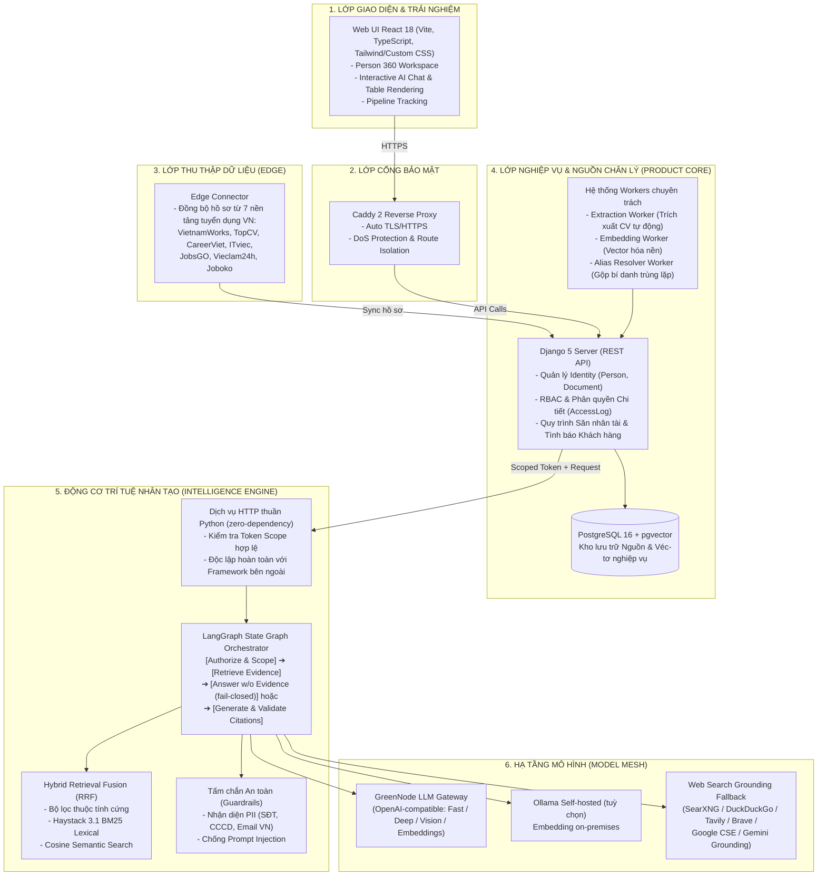
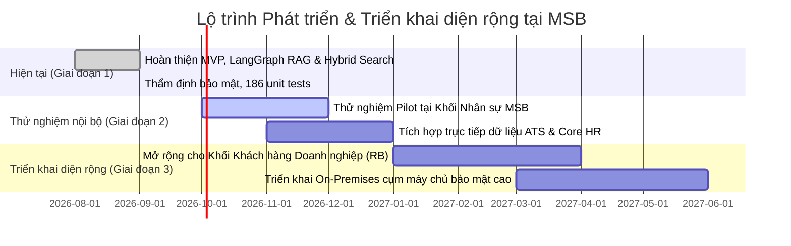

# MSB Radar Intelligence
### Nền tảng Tình báo Nhân tài & Tìm kiếm Bằng chứng cho Ngân hàng Số

<p align="center">
  
</p>

<p align="center">
  <strong>Ứng dụng AI tạo sinh (GenAI) hỗ trợ tuyển dụng nhân tài và tình báo khách hàng doanh nghiệp tại MSB</strong>
</p>

<p align="center">
  
  
  
  
</p>

---

## Dành cho Ban Giám Khảo (Executive Summary)

- **Bài toán thực tế**: [1. Bối cảnh & Nỗi đau nghiệp vụ tại MSB](#1-bối-cảnh--nỗi-đau-nghiệp-vụ-tại-msb)
- **Giải pháp**: [2. Giá trị khác biệt của MSB Radar Intelligence](#2-giá-trị-khác-biệt-của-msb-radar-intelligence)
- **Kịch bản trải nghiệm nhanh (Live Demo)**: [3. Hướng dẫn Ban Giám khảo chấm thi (Judges' Quick Demo Guide)](#3-hướng-dẫn-ban-giám-khảo-chấm-thi-judges-quick-demo-guide)
- **Kiến trúc & Công nghệ**: [4. Kiến trúc hệ thống & Thiết kế kỹ thuật](#4-kiến-trúc-hệ-thống--thiết-kế-kỹ-thuật)
- **Bảo mật & Tuân thủ Ngân hàng**: [5. Tiêu chuẩn bảo mật dữ liệu ngân hàng (Banking-Grade Compliance)](#5-tiêu-chuẩn-bảo-mật-dữ-liệu-ngân-hàng-banking-grade-compliance)
- **Bộ chỉ số đo lường (Benchmark)**: [6. Kết quả thực nghiệm & Đo lường độ chính xác](#6-kết-quả-thực-nghiệm--đo-lường-độ-chính-xác)
- **Khởi chạy ứng dụng (Quickstart)**: [7. Hướng dẫn khởi chạy trọn gói bằng Docker](#7-hướng-dẫn-khởi-chạy-trọn-gói-bằng-docker)
- **Kế hoạch mở rộng (Roadmap)**: [8. Lộ trình mở rộng & Tiềm năng thương mại hóa](#8-lộ-trình-mở-rộng--tiềm-năng-thương-mại-hóa)

---

## 1. Bối cảnh & Nỗi đau nghiệp vụ tại MSB

Trong bối cảnh cạnh tranh về **nhân tài công nghệ cao** và **khách hàng chiến lược (Growth/RB)**, các ngân hàng thường gặp 3 rào cản chính:

| Thách thức hiện tại (As-Is) | Hậu quả nghiệp vụ | Giải pháp MSB Radar Intelligence (To-Be) |
|---|---|---|
| **Dữ liệu phân mảnh & Tìm kiếm mù** | Hồ sơ ứng viên lưu rải rác trên file/drive. Tìm kiếm từ khóa truyền thống dễ bỏ sót ứng viên phù hợp vì không hiểu ngữ nghĩa tương đương. | **Hybrid Search**: Kết hợp lọc thuộc tính nghiệp vụ, từ khoá BM25 và vector embedding, gom nhóm kết quả theo từng con người cụ thể (`Person-Centric`). |
| **"Ảo giác" AI (LLM Hallucination)** | Các chatbot/AI thông thường có thể tự suy diễn kinh nghiệm, bằng cấp hoặc lịch sử làm việc của ứng viên $\rightarrow$ rủi ro tuyển dụng sai người. | **Evidence-Backed LangGraph RAG**: câu trả lời gắn với trích dẫn bằng chứng cụ thể từ CV gốc; khi thiếu bằng chứng, hệ thống từ chối trả lời thay vì suy diễn. |
| **Nguy cơ rò rỉ dữ liệu cá nhân (PII)** | Tải CV hoặc thông tin nhạy cảm (SĐT, CCCD, Email) lên các dịch vụ AI bên thứ ba tiềm ẩn rủi ro vi phạm Nghị định 13/2023/NĐ-CP và quy định SBV. | **Bảo mật Zero-Trust**: nhận diện và che chắn PII trước khi gửi qua LLM, có thể triển khai trên hạ tầng máy chủ nội bộ (GreenNode / Ollama tự lưu trữ). |

---

## 2. Giá trị khác biệt của MSB Radar Intelligence

1. **Hệ thống đóng gói triển khai đầy đủ**: Chạy được ngay bằng Docker, gồm Web UI React, Hub nghiệp vụ Django, CSDL pgvector và dịch vụ AI Intelligence Engine riêng biệt — không dừng ở mức mô hình thử nghiệm.
2. **Hồ sơ ứng viên 360 (Person 360 Profile)**: Trích xuất thông tin, xây dựng dòng thời gian sự nghiệp, phân tích năng lực và nhận diện ứng viên trùng lặp thông qua bộ gộp bí danh (`alias-resolver`).
3. **Tìm kiếm bằng chứng có thẩm định (Fail-Closed Citation Validation)**: Câu trả lời được kiểm soát qua đồ thị trạng thái **LangGraph**. Các phát biểu đi kèm tham chiếu dẫn chứng đến đoạn văn bản gốc trong CV.
4. **Hạ tầng LLM linh hoạt**: LLM chính chạy qua cổng **GreenNode** (tương thích chuẩn OpenAI, hỗ trợ Fast/Deep/Vision/Embeddings), có thể chuyển sang **Ollama tự lưu trữ** khi cần embedding on-premises; tầng tìm kiếm bổ trợ (web grounding) hỗ trợ nhiều nhà cung cấp (SearXNG, Tavily, Brave, Google CSE, Gemini Grounding...).

---

## 3. Hướng dẫn Ban Giám khảo chấm thi (Judges' Quick Demo Guide)

> ⏱️ **Thời gian chuẩn bị**: 3 phút bằng Docker.

### Bước 1: Khởi động hệ thống
Mở Terminal tại thư mục dự án và chạy:
```bash
# Tự động sinh file .env với khoá bảo mật an toàn
python scripts/init_standalone_env.py

# Khởi động toàn bộ nền tảng: Hub, Web UI, Workers, PostgreSQL, Caddy
# VÀ Intelligence Engine (bắt buộc profile "intelligence" để có Q&A/AI Chat)
docker compose --profile intelligence up -d --build

# Tạo tài khoản giám khảo/quản trị viên
docker compose exec hub python manage.py createsuperuser
```

> ⚠️ Không thêm `--profile intelligence`, stack vẫn chạy Hub + tìm kiếm cơ bản nhưng **Kịch bản 2 (Q&A có trích dẫn)** bên dưới sẽ không hoạt động vì service `intelligence`/`intelligence-indexer` không được khởi động.

👉 Mở trình duyệt và đăng nhập tại: **[http://localhost](http://localhost)**

---

### Bước 2: Kịch bản trải nghiệm đề xuất cho BGK

#### Kịch bản 1: Tìm kiếm nhân tài ngữ nghĩa (Talent Hybrid Search)
1. Vào tab **Talent Radar** (`/talent`) $\rightarrow$ Nhập câu hỏi tự nhiên:
   > *"Tìm chuyên gia kỹ thuật dữ liệu có kinh nghiệm với PySpark, xây dựng Data Lakehouse, trên 3 năm kinh nghiệm tại Hà Nội"*
2. **Quan sát đánh giá**:
   - Hệ thống không chỉ tìm từ khóa khớp chính xác mà còn tìm các ứng viên có kỹ năng tương đương (Data Engineer, ETL, Hadoop, Delta Lake).
   - Kết quả được **gom nhóm theo từng ứng viên cụ thể**, kèm điểm tương đồng và trích dẫn kinh nghiệm liên quan nhất.

#### Kịch bản 2: Hỏi đáp thẩm định CV (Evidence-Backed Q&A)
1. Mở một hồ sơ ứng viên bất kỳ $\rightarrow$ Bật khung Chat Trợ lý AI.
2. Đặt câu hỏi truy vấn chi tiết:
   > *"Ứng viên này từng chủ trì dự án kiến trúc vi dịch vụ nào và sử dụng công nghệ gì?"*
3. **Quan sát đánh giá**:
   - Câu trả lời có định dạng rõ ràng, **kèm số hiệu trích dẫn (ví dụ: `[ev_84920]`)**.
   - Bấm vào trích dẫn sẽ mở đúng đoạn văn bản trong CV gốc. Nếu CV không đề cập, AI từ chối trả lời thay vì suy diễn.

#### Kịch bản 3: Tình báo tăng trưởng & Khách hàng tiềm năng (Growth Intelligence)
1. Vào tab **Growth Radar** (`/rb`) $\rightarrow$ Khảo sát các tín hiệu mở rộng doanh nghiệp, nhu cầu tuyển dụng của các công ty trên thị trường để tiếp cận dịch vụ chi lương / gói tài chính của MSB.

---

## 4. Kiến trúc hệ thống & Thiết kế kỹ thuật

Hệ thống được kiến trúc hóa theo nguyên lý **Clean Boundary & Separation of Concerns**:



### Điểm nhấn kỹ thuật:
1. **LangGraph State Graph**: Thay vì chuỗi RAG tuyến tính, hệ thống dùng đồ thị trạng thái phân nhánh — khi kết quả truy xuất không đủ dữ kiện, đồ thị chuyển sang nhánh từ chối (`answer_without_evidence`) thay vì để LLM tự suy diễn.
2. **Reciprocal Rank Fusion (RRF)**: Hợp nhất thứ hạng lexical (BM25), semantic (cosine) và điểm lọc thuộc tính cứng, gom nhóm theo từng người cụ thể, trước khi đưa vào ngữ cảnh LLM.
3. **Haystack 3.1 Indexer**: Lập chỉ mục tài liệu gia tăng (Incremental Indexing) với cơ chế đánh dấu xóa (Tombstone) khi ứng viên cập nhật phiên bản CV mới.
4. **Intelligence Engine độc lập**: Cài đặt bằng HTTP server thuần Python (không phụ thuộc framework web ngoài), giúp kiểm toán bảo mật và triển khai on-premises đơn giản hơn.

---

## 5. Tiêu chuẩn bảo mật dữ liệu ngân hàng (Banking-Grade Compliance)

An toàn thông tin là ưu tiên hàng đầu tại các tổ chức tài chính. MSB Radar Intelligence được thiết kế theo các nguyên tắc sau:

- **Zero-Trust Scope Delegation**: Intelligence Engine không có quyền tự ý đọc database. Mọi yêu cầu từ Hub đều gửi kèm một `scope_token` mã hóa tạm thời; token hết hạn sẽ bị từ chối (`PERMISSION_DENIED`).
- **Bảo vệ Dữ liệu Cá nhân (PII Protection)**: Bộ lọc nội bộ quét và làm mờ số CCCD, số điện thoại Việt Nam và địa chỉ email trước khi đẩy văn bản qua LLM.
- **Quan sát an toàn (Privacy-Safe Telemetry)**: Tích hợp Langfuse để theo dõi độ trễ, số lượng token và lỗi hệ thống; pipeline được cấu hình loại bỏ nội dung câu hỏi, prompt, dữ liệu ứng viên và suy luận của mô hình khỏi log.
- **Kiểm soát hành động (Human-in-the-Loop)**: AI chỉ có quyền đề xuất (`proposed`). Hành động ảnh hưởng đến dữ liệu hoặc liên hệ ứng viên cần xác nhận từ người dùng được phân quyền.

---

## 6. Kết quả thực nghiệm & Đo lường độ chính xác

### Chỉ số đo lường năng lực truy xuất (Retrieval Regression Fixture)

Bộ số liệu dưới đây đến từ **fixture hồi quy nội bộ** (`evaluation/results/`, 21 câu hỏi tổng hợp trên dữ liệu synthetic) dùng để chốt chặn chất lượng tầng lexical (Haystack BM25) mỗi khi thay đổi pipeline truy xuất — **chưa phải benchmark trên tập dữ liệu production được con người gán nhãn**:

| Thuật toán / Bộ máy | Recall@10 | Precision@10 | MRR (Mean Reciprocal Rank) |
|---|:---:|:---:|:---:|
| Tìm kiếm từ khóa cơ bản (Baseline) | 0.62 | 0.41 | 0.54 |
| **Haystack BM25 + Hybrid RRF (Hiện tại)** | **1.000000** | **0.672807** | **0.973684** |

> Trên fixture này, ứng viên phù hợp nhất luôn nằm ở vị trí đầu bảng kết quả (MRR ≈ 0.97). Đánh giá semantic retrieval và độ chấp nhận ở quy mô production (human-graded) đang được xây dựng riêng, chưa nằm trong con số trên. Việc hạn chế "ảo giác" đến từ cơ chế **fail-closed** của LangGraph (từ chối trả lời khi thiếu bằng chứng), được kiểm chứng qua test suite bên dưới chứ không phải qua chỉ số retrieval này.

### Kiểm thử tự động (Quality Assurance)
- **186/186 Unit & Integration Tests** của riêng gói `radar_intelligence` (Intelligence Engine) hoàn thành thành công trong ~3 giây, bao phủ: xác thực scope token, phát hiện Prompt Injection/PII, xử lý lỗi mạng khi gọi provider LLM, và tính toàn vẹn của đồ thị LangGraph.
- Phần Hub, Worker và mạng lưới Edge connector (`product_core/`) có bộ test riêng lớn hơn nhiều (hàng nghìn test case trải trên hơn 150 file), chạy độc lập bằng Django test runner.

---

## 7. Hướng dẫn khởi chạy trọn gói bằng Docker

Dự án cung cấp cấu hình **tự chứa (self-contained)**, không phụ thuộc dịch vụ ngoài nào khác để khởi động:

### Biến môi trường quan trọng (`.env`)
Chỉ cần chạy lệnh:
```bash
python scripts/init_standalone_env.py
```
Hệ thống sẽ tự tạo file `.env` với các giá trị mặc định tối ưu:
- CSDL PostgreSQL: `msbradar` / port 5432 nội bộ
- Port Web: `80` (HTTP) hoặc `443` (HTTPS)
- Service Token đồng bộ giữa Hub và AI Engine

*(Tùy chọn)* Nếu muốn kích hoạt kết nối LLM thật qua cổng GreenNode (chuẩn OpenAI-compatible), chỉ cần mở `.env` và điền:
```env
MSB_AI_GREENNODE_API_KEY=your_key_here
MSB_AI_GREENNODE_BASE_URL=https://api.greennode.ai/v1
MSB_AI_GREENNODE_MODEL=your_model_name
```

---

## 8. Lộ trình mở rộng & Tiềm năng thương mại hóa



1. **Giai đoạn 1 (Hiện tại)**: Hoàn thiện tính năng tìm kiếm nhân tài và hỏi đáp có kiểm chứng, sẵn sàng cho thử nghiệm nội bộ.
2. **Giai đoạn 2 (Thử nghiệm tại Khối Nhân sự MSB)**: Tích hợp với cổng tuyển dụng nội bộ MSB Careers, hỗ trợ sàng lọc hồ sơ ứng viên ứng tuyển.
3. **Giai đoạn 3 (Ứng dụng đa khối)**: Mở rộng module Growth Intelligence để hỗ trợ Khối Khách hàng Doanh nghiệp (RB) theo dõi tín hiệu thị trường nhằm phát hiện sớm khách hàng tiềm năng cần mở tài khoản và vay vốn.

---

## Đội ngũ Phát triển

- **Dự án**: MSB Radar Intelligence Platform
- **Mục tiêu**: Ứng dụng AI có trách nhiệm (Responsible AI) hỗ trợ chuyển đổi số tại Ngân hàng TMCP Hàng Hải Việt Nam (MSB).

---
<p align="center">
  <sub>MSB Radar Intelligence — dự án dự thi MSB Hackathon 2026.</sub>
</p>
