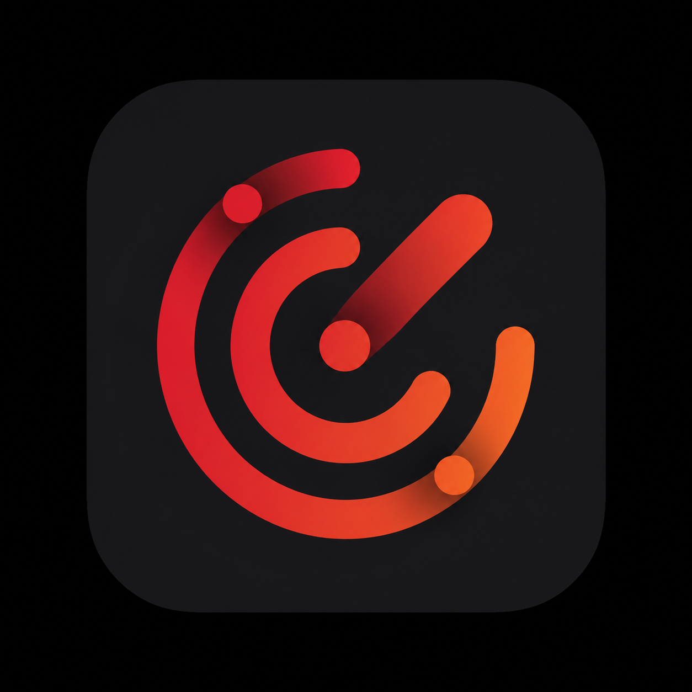
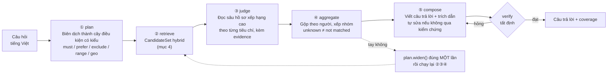
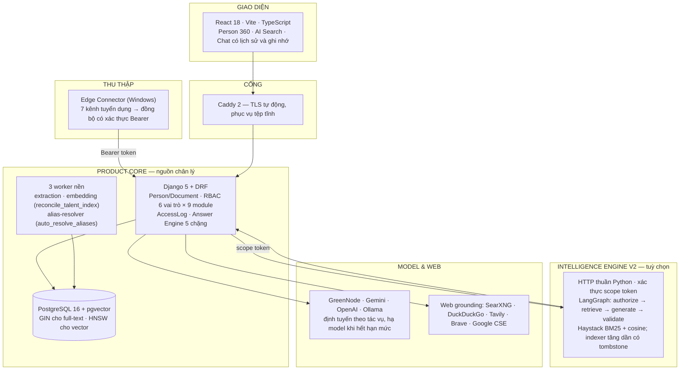

# MSB Radar Intelligence
### Nền tảng tìm kiếm nhân tài & tình báo khách hàng có bằng chứng

<p align="center">
  
</p>

<p align="center">
  <strong>Tìm đúng người trong kho hồ sơ, trả lời bằng trích dẫn từ CV gốc, và nói thật phần nào chưa đọc tới.</strong>
</p>

<p align="center">
  🔗 <strong>Bản chạy thật: <a href="https://dev-radar.tunghr.io.vn">dev-radar.tunghr.io.vn</a></strong> — cần tài khoản được cấp; kiểm tra sức khoẻ công khai tại <a href="https://dev-radar.tunghr.io.vn/api/v1/health/"><code>/api/v1/health/</code></a>
</p>

<p align="center">
  
  
  
  
</p>

---

## Đọc nhanh

| Bạn là | Đọc mục |
|---|---|
| Ban giám khảo | [1. Bài toán](#1-bài-toán-nghiệp-vụ) · [2. Hệ thống có gì](#2-hệ-thống-gồm-những-gì) · [7. Chạy thử & kịch bản demo](#7-chạy-thử-trong-10-phút) |
| Kiến trúc sư / kỹ sư | [3. Bộ não trả lời](#3-bộ-não-trả-lời--năm-chặng) · [4. Tầng tìm kiếm](#4-tầng-tìm-kiếm--candidateset-hybrid) · [5. Kiến trúc triển khai](#5-kiến-trúc-triển-khai) |
| An ninh thông tin / tuân thủ | [6. Bảo mật & quyền](#6-bảo-mật-quyền-và-dữ-liệu-cá-nhân) |
| Người soi số liệu | [8. Số đã đo và số CHƯA đo](#8-số-đã-đo--và-số-chưa-đo) · [9. Trạng thái thật](#9-trạng-thái-thật-và-việc-còn-lại) |

---

## 1. Bài toán nghiệp vụ

| Thực trạng | Hậu quả | Cách hệ thống xử lý |
|---|---|---|
| Hồ sơ ứng viên nằm rải trên nhiều kênh tuyển dụng và ổ đĩa cá nhân | Tìm bằng từ khoá bỏ sót ứng viên diễn đạt khác đi ("Data Engineer" vs "kỹ sư dữ liệu"), và không ai biết đã bỏ sót | Đồng bộ về một kho duy nhất; tìm bằng **SQL có cấu trúc + full-text có từ điển đồng nghĩa + vector ngữ nghĩa**, rồi hợp nhất theo từng con người |
| Chatbot thường tự suy diễn kinh nghiệm ứng viên | Tuyển sai người, không truy được vì sao AI nói vậy | Mỗi phát biểu gắn **trích dẫn tới đoạn văn bản gốc** trong CV; không có bằng chứng thì nói thẳng là không có |
| "Đã rà soát toàn bộ" thường là câu nói suông | Người dùng tin nhầm vào một kết quả mới đọc được vài chục hồ sơ | Mỗi câu trả lời kèm **coverage**: tìm được bao nhiêu, đọc sâu bao nhiêu, còn bao nhiêu chưa đọc |
| Đẩy CV lên dịch vụ AI bên ngoài | Rủi ro với Nghị định 13/2023/NĐ-CP và quy định SBV | Che PII trước khi gửi model, phân quyền theo vai trò, ghi log truy cập, có đường chạy embedding on-premises |

---

## 2. Hệ thống gồm những gì

Đây không phải một notebook demo. Repo chứa **ba phần chạy được độc lập**:

| Phần | Nằm ở | Vai trò |
|---|---|---|
| **Product Core** | [product_core/](product_core/) | Hub Django 5 + REST API, giao diện React 18 (Vite/TS), 3 worker nền, PostgreSQL 16 + pgvector, Caddy. Đây là nguồn chân lý và là thứ đang chạy trên production. |
| **Edge Connector** | [product_core/edge/](product_core/edge/) | Ứng dụng desktop Windows (gói ZIP portable) tự tải CV từ **TopCV, VietnamWorks, CareerViet, ITviec, JobsGO, Vieclam24h, Joboko** rồi đồng bộ lên Hub. |
| **Intelligence Engine (V2)** | [radar_intelligence/](radar_intelligence/) | Dịch vụ HTTP Python thuần, không phụ thuộc web framework: LangGraph + Haystack BM25 + cosine, xác thực bằng **scope token** do Hub cấp. Bật bằng `--profile intelligence`, đóng vai nguồn truy hồi bổ sung cho Hub. |

### Các module nghiệp vụ đang có trong giao diện

| Đường dẫn | Module | Nội dung |
|---|---|---|
| `/search` | Tìm kiếm AI | Hỏi bằng tiếng Việt tự nhiên, đổi góc nhìn Nhân tài ↔ Khách hàng, xem tiến trình từng chặng |
| `/talent`, `/talent/:id` | Talent Radar | Chiến dịch săn người; Person 360: dòng thời gian sự nghiệp, fact đã trích, tài liệu gốc, chat theo hồ sơ |
| `/rb` | Growth Radar | Tín hiệu mở rộng doanh nghiệp, chấm điểm prospect, gợi ý tiếp cận cho khối khách hàng |
| `/social` | Social Radar | Tín hiệu từ nguồn mạng xã hội |
| `/knowledge` | Kho tri thức | Tài liệu nội bộ được đưa vào ngữ cảnh trả lời |
| `/data` | Dữ liệu & nhập liệu | Vận hành Edge, hàng chờ nhập hồ sơ, xử lý lỗi bóc tách |
| `/workflows`, `/dashboard` | Quy trình & báo cáo | Theo dõi pipeline tuyển dụng, số liệu vận hành |
| `/settings`, `/admin` | Cấu hình AI & quản trị | Nhà cung cấp model, định tuyến theo tác vụ, khoá API, phân quyền |

Tài liệu API mở tại `/api/v1/docs/` (Swagger — xem không cần đăng nhập, gọi thật thì vẫn phải xác thực đúng từng endpoint).

---

## 3. Bộ não trả lời — năm chặng

Trái tim sản phẩm là Answer Engine trong [product_core/server/talent/answer/](product_core/server/talent/answer/) (bản song sinh cho khách hàng doanh nghiệp ở [rb/answer/](product_core/server/rb/answer/)). Không phải một lời gọi LLM, mà một pipeline có ngân sách thời gian và có kiểm chứng:



Bốn quyết định thiết kế đáng chú ý:

1. **Code quyết trước, AI quyết sau.** Mọi thứ xác định được bằng SQL (số năm kinh nghiệm, địa điểm, bằng cấp, ngành) do database quyết. LLM chỉ đọc phần ngữ nghĩa không cấu trúc. Nhờ vậy kết quả tái lập được và rẻ hơn nhiều so với nhét cả kho vào prompt.
2. **Ngân sách thời gian cứng.** Engine tự giữ trần 135 giây mỗi lượt, dưới trần 150 giây của runner; riêng chặng đọc sâu trần 80 giây. Hết giờ thì **dựng câu trả lời bằng code** từ những gì ③④ đã chốt (vẫn có danh sách và trích dẫn), thay vì để người dùng nhận màn hình rỗng.
3. **Nói thật phần chưa đọc.** `coverage` ghi rõ `candidate_total`, `judged`, `not_read`, `read_failed` và được lưu vào `AnswerRun` để audit hồi tố. Câu "đã rà soát toàn bộ" chỉ được phép xuất hiện khi thật sự đủ điều kiện.
4. **Nới một lần, không nới vô hạn.** Truy hồi về tay không thì mở rộng điều kiện đúng một lượt rồi chạy lại; quá ngân sách thì thà nói "kho không có" còn hơn trả một câu trả lời loãng.

**Định tuyến model** ([ai/router.py](product_core/server/ai/router.py)): mỗi tác vụ (plan / judge / compose / intent / tool call) có chuỗi model ưu tiên riêng. Gặp lỗi hạn mức hoặc bị từ chối thì **hạ xuống model tốt kế tiếp**, ghi nhớ cặp provider–model đã bị từ chối 404/402, và tự xếp hàng bằng token bucket theo từng provider thay vì nhận 429. Hỗ trợ GreenNode (OpenAI-compatible), Gemini, OpenAI và Ollama tự lưu trữ.

---

## 4. Tầng tìm kiếm — CandidateSet hybrid

[talent/search_v2.py](product_core/server/talent/search_v2.py) dựng một **CandidateSet** hợp nhất theo Person; mọi thành viên đều giữ nguồn gốc và điểm số:

| Nhánh | Kỹ thuật | Dùng để |
|---|---|---|
| Structured | SQL trên `SearchProjection` | Ranh giới đúng/sai cho điều kiện tất định — đẩy hẳn xuống database, không quét Python toàn kho |
| Field FTS | `tsvector` + chỉ mục GIN, Boolean AST (trần độ sâu 8 / 50 leaf) | Khớp từ khoá theo đúng trường, giữ nguyên `AND/OR/NOT` |
| Từ điển đồng nghĩa | Bảng `SearchVocabulary`, quản trị bằng lệnh `search_vocabulary` | Alias Anh–Việt, có dấu–không dấu, viết tắt; alias được nạp vào cả `tsquery` |
| Vector | pgvector HNSW, ANN **có pre-filter** bằng subquery, bật `hnsw.iterative_scan` khi tập lớn | Bắt các cách diễn đạt tương đương mà từ khoá bỏ sót |
| Pinned / application | Ghim thủ công, dữ liệu ứng tuyển | Không làm mất hồ sơ đã biết chắc là liên quan |

Sau khi hợp nhất, hệ thống **xác minh lại toàn bộ điều kiện tất định** trên cả tập, rồi đưa thứ hạng vào xếp hạng deep-read bằng **RRF**: CandidateSet V2 là *một nguồn xếp hạng*, không phải danh sách ghim cứng — hồ sơ chỉ xuất hiện ở đường truy hồi cũ vẫn được giữ, nên việc bật V2 không làm mất recall. CandidateSet bị `blocked`, `retrieval_degraded` hoặc chưa chạy đủ nhánh bắt buộc thì **không được dùng**, và trạng thái hiện ra là *degraded* chứ không phải "đã tìm toàn bộ".

Thiết kế nhắm mốc 500.000 Person / 5 triệu chunk: không nhét danh sách ID vào `IN (...)`, không quét toàn kho bằng Python, giới hạn chi phí LLM theo dạng phễu. Kho production hiện tại khoảng 1.000 Person, nên mốc quy mô đó **chưa được kiểm chứng bằng dữ liệu thật**.

---

## 5. Kiến trúc triển khai



Triển khai bằng một lệnh `docker compose`. Ba profile tuỳ chọn: `intelligence` (Engine V2 + indexer), `searxng` (tìm web tự lưu trữ), `selfhost-embed` (Ollama cho embedding on-premises).

Bản production đang chạy tại **https://dev-radar.tunghr.io.vn**, deploy qua GitHub Actions self-hosted runner ([deploy-oracle.yml](.github/workflows/deploy-oracle.yml)) với bước xác minh health đúng SHA vừa build — mỗi lần deploy đều so `current-sha` trên máy chủ với SHA của commit đang build trước khi coi là thành công.

---

## 6. Bảo mật, quyền và dữ liệu cá nhân

- **RBAC hai chiều**: 6 vai trò (`admin`, `recruiter`, `hiring_manager`, `rb_sales`, `manager`, `edge_operator`) × 9 module (`talent`, `rb`, `social`, `knowledge`, `edge_ops`, `people_intake`, `reports`, `ai_settings`, `admin_console`). Giao diện và API cùng kiểm tra một bảng quyền; `AccessLogMiddleware` ghi lại truy cập.
- **Scope token cho Intelligence Engine**: Engine V2 **không có quyền tự đọc database**. Mỗi yêu cầu từ Hub mang một scope token có hạn; hết hạn hoặc sai phạm vi thì trả `PERMISSION_DENIED`. Truy hồi lọc phạm vi **trước** khi tìm, không lọc sau.
- **Che PII trước khi gửi model** ([ai/pii.py](product_core/server/ai/pii.py)): số điện thoại, CCCD, email Việt Nam. Kèm `prompt_guard.py` chống prompt injection.
- **Trích dẫn fail-closed**: mỗi trích dẫn được đối chiếu với danh tính nguồn hiện tại, phiên bản, hash, trạng thái xoá và phạm vi quyền của người hỏi. Tài liệu đã xoá hoặc đã đổi phiên bản thì trích dẫn bị loại, không hiển thị.
- **Telemetry không lộ nội dung**: theo dõi độ trễ, token và lỗi; pipeline loại câu hỏi, prompt, dữ liệu ứng viên và chuỗi suy luận ra khỏi log.
- **Người quyết định cuối**: AI chỉ đề xuất; hành động chạm dữ liệu hoặc liên hệ ứng viên cần người có quyền xác nhận.
- **Xếp hạng theo giới tính / tuổi / hôn nhân** là một cổng pháp chế riêng, **mặc định tắt**.

---

## 7. Chạy thử trong 10 phút

### Cách nhanh nhất: dùng bản đang chạy

**https://dev-radar.tunghr.io.vn** là bản production thật — cùng dữ liệu, cùng model, cùng cấu hình được nói tới ở [mục 8](#8-số-đã-đo--và-số-chưa-đo). Cần tài khoản được cấp để đăng nhập; hai đường xem được mà không cần đăng nhập là [`/api/v1/health/`](https://dev-radar.tunghr.io.vn/api/v1/health/) và [`/api/v1/docs/`](https://dev-radar.tunghr.io.vn/api/v1/docs/).

### Hoặc dựng bản của riêng bạn

```bash
# 1. Sinh .env với khoá ngẫu nhiên an toàn
python scripts/init_standalone_env.py

# 2. Dựng toàn bộ nền tảng (Hub, Web, 3 worker, PostgreSQL+pgvector, Caddy)
#    Thêm --profile intelligence nếu muốn chạy cả Engine V2 và indexer của nó.
docker compose up -d --build

# 3. Tạo tài khoản quản trị
docker compose exec hub python manage.py createsuperuser
```

Mở **http://localhost**. Kiểm tra sức khoẻ tại `/api/v1/health/`, tài liệu API tại `/api/v1/docs/`.

Muốn gọi model thật, điền vào `.env`:

```env
MSB_AI_GREENNODE_API_KEY=...
MSB_AI_GREENNODE_BASE_URL=https://api.greennode.ai/v1
MSB_AI_GREENNODE_MODEL=...
```

Không có khoá thì Hub vẫn chạy: tìm kiếm có cấu trúc, full-text, Person 360 và quản lý pipeline đều hoạt động; chỉ những chặng cần model mới báo degraded.

Dữ liệu demo tái lập được bằng `python manage.py seed_demo --reset`; `python manage.py test core.tests_hero_flow` chạy bằng máy toàn bộ đường demo. Runbook ngày demo: [product_core/docs/DEMO.md](product_core/docs/DEMO.md).

### Ba kịch bản đáng xem

**① Tìm người bằng câu hỏi thật** — vào `/search`:

> *"Tìm Tech Lead hoặc Senior Backend Java/Golang từng làm lĩnh vực tài chính, trên 5 năm kinh nghiệm, ở Hà Nội"*

Đáng chú ý: điều kiện cứng được đẩy xuống SQL, điều kiện ngữ nghĩa mới để AI đọc; hệ thống tìm được cả người viết "kỹ sư backend" thay vì "Backend Engineer" nhờ từ điển alias và nhánh vector; timeline từng chặng hiện ngay trên giao diện; và cuối câu trả lời là dòng coverage nói thẳng đã đọc sâu bao nhiêu hồ sơ trên tổng số tìm được.

**② Hỏi sâu một hồ sơ** — mở `/talent/:id` rồi hỏi trong khung chat:

> *"Ứng viên này từng chủ trì dự án kiến trúc vi dịch vụ nào, dùng công nghệ gì?"*

Đáng chú ý: mỗi ý đều có số hiệu trích dẫn, bấm vào mở đúng đoạn trong CV gốc; nếu CV không đề cập, AI trả lời là không tìm thấy thay vì suy diễn.

**③ Tình báo tăng trưởng** — vào `/rb`: tín hiệu mở rộng và nhu cầu tuyển dụng của doanh nghiệp trên thị trường, chấm điểm và gợi ý tiếp cận cho dịch vụ chi lương / gói tài chính của MSB. Dùng chính bộ máy trả lời năm chặng, khác bộ tiêu chí.

---

## 8. Số đã đo — và số CHƯA đo

Mục này cố ý tách bạch ba loại: số đo trên **dữ liệu thật ở production**, số đo trên **fixture tổng hợp**, và những thứ **chưa đo**.

### Đo trên production, dữ liệu thật

Ablation (`python manage.py search_ablation`) trên bộ **silver 23 case** — 14 case tất định chấm được bằng SQL, 9 case ngữ nghĩa mang `status=needs_review` nên bị bỏ qua và công cụ in rõ số bị bỏ:

| Cấu hình nhánh | Recall@CandidateSet |
|---|:---:|
| Structured + field FTS | **1,000** |
| Structured + vector | **0,960** |
| Full hybrid | **1,000** |

Chính ablation này tìm ra hai lỗi thật đang chạy: alias chưa được nạp vào `tsquery` (bỏ sót 14/319 hồ sơ), và một lỗi của **chính công cụ đo** — nó gọi embedding hai lần mỗi case nên tự chạm hạn mức, khiến nhánh vector suýt bị kết luận nhầm là vô dụng; số thật là 0,96.

**Trạng thái kho production:** 611/611 hồ sơ có projection, dossier và person embedding; 2.229/2.229 CV chunk có vector 1024 chiều; chỉ mục GIN và HNSW đều tồn tại.

**Probe cuối bằng đúng câu demo:** hoàn tất 99,08 giây — truy hồi 16, đọc sâu 16, `not_read=0`, `read_failed=false`, compose không phải hạ model; với lượt tìm toàn kho, coverage báo đúng `candidate_total=500`, `judged=16`, `not_read=484`.

### Đo trên fixture tổng hợp

Fixture hồi quy sáu người, 21 case ([evaluation/results/](evaluation/results/)), dùng để chốt chặn tầng lexical của Engine V2 mỗi khi đổi pipeline — **không phải benchmark production**:

| Cấu hình | Recall@10 | Precision@10 | MRR |
|---|:---:|:---:|:---:|
| Token overlap (baseline) | 1,000 | 0,673 | 0,912 |
| Haystack BM25 + token-presence gate | 1,000 | 0,673 | **0,974** |

### Kiểm thử tự động

| Bộ | Số test | Chạy bằng |
|---|---|---|
| Intelligence Engine V2 | **186** trên 33 tệp | `pytest tests` |
| Hub backend (Django) | lần chạy trọn bộ gần nhất được ghi nhật ký: **1.947**; đợt thay đổi gần đây chạy lại `ai + talent`: **978/978** | `python manage.py test` trong `product_core/server` |
| Giao diện | 142 test (Vitest) | `npm test` trong `product_core/web` |

### CHƯA đo — không được dùng như lời tuyên bố

- **Gold set thật**: bộ silver 23 case chưa phải gold. Cổng còn lại: ≥60 câu, hai người gán nhãn độc lập, đo độ đồng thuận, chốt ngưỡng `unknown`.
- **Chất lượng câu trả lời có người chấm**: tỉ lệ phát biểu không bằng chứng, độ trung thực, câu hỏi nhiều bước — đều chưa có số.
- **Quy mô 500k**: thiết kế nhắm mốc đó nhưng fixture scale chưa chạy trên staging.
- **Semantic recall tuyệt đối**: theo định nghĩa không thể tuyên bố; chỉ đo được bằng Recall@CandidateSet trên gold set có nhãn.

---

## 9. Trạng thái thật và việc còn lại

Nhật ký bàn giao chi tiết: [product_core/docs/RADAR_AI_SEARCH_EXECUTION_BACKLOG.md](product_core/docs/RADAR_AI_SEARCH_EXECUTION_BACKLOG.md) — mục 17 ghi từng commit, từng workflow deploy và cả những lần chẩn đoán sai đã được sửa. Trạng thái Engine V2: [docs/PHASE_STATUS.md](docs/PHASE_STATUS.md).

**Đang chạy thật trên production:** đường trả lời năm chặng · CandidateSet V2 nối vào xếp hạng RRF · nhánh FTS có chỉ mục và nhánh vector ANN · từ điển alias quản trị được · chuỗi model dự phòng khi hết hạn mức · coverage lưu vào `AnswerRun` để audit hồi tố.

**Còn ở ngoài cổng:** gold set hai người gán nhãn · fixture 500k trên staging · ADR vector và chi phí · capacity provider và cửa sổ quan sát 24 giờ · phê duyệt pháp chế cho các trường nhạy cảm · biến deep-read từng phần thành exhaustive thật sự.

**Hướng tiếp theo (không kèm cam kết ngày):** tích hợp thẳng dữ liệu ATS / Core HR của MSB; mở rộng Growth Radar cho khối khách hàng doanh nghiệp; triển khai on-premises trọn gói với embedding tự lưu trữ.

---

## 10. Bản đồ mã nguồn

```
product_core/
  server/          Django Hub — 13 app nghiệp vụ
    talent/        Talent Radar; search_v2.py; answer/ (engine 5 chặng)
    rb/            Growth Radar; answer/ bản song sinh cho khách hàng doanh nghiệp
    ai/            Định tuyến model, hội thoại và ghi nhớ, PII, prompt guard, telemetry
    people/        Person, Document, Identity, gộp bí danh
    core/          Bóc tách CV, lưu trữ tệp, workflow, worker nền
    accounts/      RBAC, AccessLog, đăng nhập
    knowledge/ intake/ hiring/ social/ reports/ agents/ intel/
  web/             React 18 + Vite + TypeScript
  edge/            Ứng dụng desktop cho 7 kênh tuyển dụng
  docs/            Tài liệu nghiệp vụ và vận hành của Product Core
radar_intelligence/  Intelligence Engine V2 (LangGraph, Haystack, scope token)
tests/               186 test của Engine V2
evaluation/          Dataset và kết quả đánh giá truy hồi
docs/                Kiến trúc, hợp đồng API, mô hình bằng chứng, runbook vận hành
scripts/             Sinh .env, cấp phát biến môi trường runtime
```

Tài liệu nên đọc trước: [docs/ARCHITECTURE.md](docs/ARCHITECTURE.md) · [docs/EVIDENCE_MODEL.md](docs/EVIDENCE_MODEL.md) · [docs/RETRIEVAL_DESIGN.md](docs/RETRIEVAL_DESIGN.md) · [product_core/docs/RADAR_ANSWER_ENGINE.md](product_core/docs/RADAR_ANSWER_ENGINE.md) · [product_core/docs/ACCESS_CONTROL.md](product_core/docs/ACCESS_CONTROL.md) · [docs/OPERATIONS_RUNBOOK.md](docs/OPERATIONS_RUNBOOK.md) · [docs/OPEN_SOURCE_ATTRIBUTION.md](docs/OPEN_SOURCE_ATTRIBUTION.md)

---

<p align="center">
  <sub>MSB Radar Intelligence — dự thi MSB Hackathon 2026. AI có trách nhiệm cho chuyển đổi số tại Ngân hàng TMCP Hàng Hải Việt Nam.</sub>
</p>
