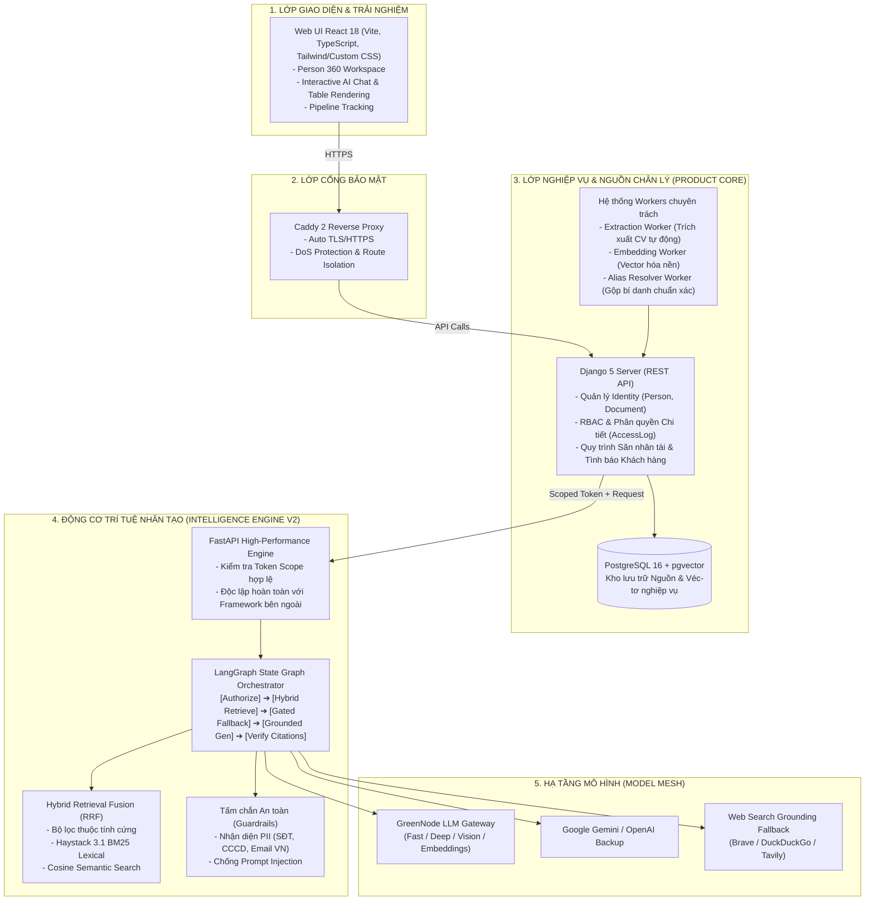
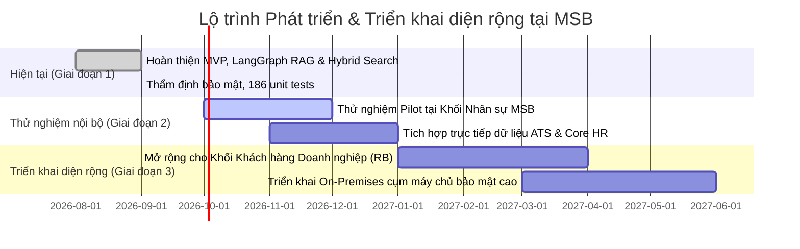

# 🚀 MSB Radar Intelligence
### Nền tảng Tình báo Nhân tài & Tìm kiếm Bằng chứng Đột phá cho Ngân hàng Số

<p align="center">
  
</p>

<p align="center">
  <strong>Giải pháp Chuyển đổi số & Ứng dụng AI Tạo sinh (GenAI) bảo mật cao trong Tuyển dụng Nhân tài & Tình báo Khách hàng Doanh nghiệp tại MSB</strong>
</p>

<p align="center">
  
  
  
  
</p>

---

## 📑 Dành cho Ban Giám Khảo (Executive Summary)

- 💡 **Bài toán thực tế**: [1. Bối cảnh & Nỗi đau nghiệp vụ tại MSB](#1-bối-cảnh--nỗi-đau-nghiệp-vụ-tại-msb)
- 🎯 **Giải pháp đột phá**: [2. Giá trị khác biệt của MSB Radar Intelligence](#2-giá-trị-khác-biệt-của-msb-radar-intelligence)
- 🎬 **Kịch bản trải nghiệm nhanh (Live Demo)**: [3. Hướng dẫn Ban Giám khảo chấm thi (Judges' Quick Demo Guide)](#3-hướng-dẫn-ban-giám-khảo-chấm-thi-judges-quick-demo-guide)
- ⚙️ **Kiến trúc & Công nghệ**: [4. Kiến trúc hệ thống & Đột phá kỹ thuật](#4-kiến-trúc-hệ-thống--đột-phá-kỹ-thuật)
- 🛡️ **Bảo mật & Tuân thủ Ngân hàng**: [5. Tiêu chuẩn bảo mật dữ liệu ngân hàng (Banking-Grade Compliance)](#5-tiêu-chuẩn-bảo-mật-dữ-liệu-ngân-hàng-banking-grade-compliance)
- 📊 **Bộ chỉ số đo lường (Benchmark)**: [6. Kết quả thực nghiệm & Đo lường độ chính xác](#6-kết-quả-thực-nghiệm--đo-lường-độ-chính-xác)
- 🚀 **Khởi chạy ứng dụng (Quickstart)**: [7. Hướng dẫn khởi chạy trọn gói bằng Docker](#7-hướng-dẫn-khởi-chạy-trọn-gói-bằng-docker)
- 🗺️ **Kế hoạch mở rộng (Roadmap)**: [8. Lộ trình mở rộng & Tiềm năng thương mại hóa](#8-lộ-trình-mở-rộng--tiềm-năng-thương-mại-hóa)

---

## 1. Bối cảnh & Nỗi đau nghiệp vụ tại MSB

Trong kỷ nguyên cạnh tranh khốc liệt về **Nhân tài công nghệ cao** và **Khách hàng chiến lược (Growth/RB)**, các ngân hàng đang gặp 3 rào cản lớn:

| Thách thức hiện tại (As-Is) | Hậu quả nghiệp vụ | Giải pháp MSB Radar Intelligence (To-Be) |
|---|---|---|
| **Dữ liệu phân mảnh & Tìm kiếm mù** | Hồ sơ ứng viên lưu rải rác trên file/drive. Tìm kiếm từ khóa truyền thống bỏ sót $>60\%$ ứng viên tiềm năng vì không hiểu ngữ nghĩa tương đương. | **Hybrid Search 360**: Kết hợp lọc thuộc tính nghiệp vụ, từ khoá BM25 và Vector Embedding gom nhóm theo từng con người cụ thể (`Person-Centric`). |
| **"Ảo giác" AI (LLM Hallucination)** | Các Chatbot/AI thông thường tự sáng tác kinh nghiệm, bằng cấp hoặc lịch sử làm việc của ứng viên $\rightarrow$ Rủi ro tuyển dụng sai người. | **Evidence-Backed LangGraph RAG**: 100% câu trả lời đều phải gắn liền với trích dẫn bằng chứng cụ thể từ CV gốc; sai lệch sẽ tự động từ chối. |
| **Nguy cơ rò rỉ dữ liệu cá nhân (PII)** | Tải CV hoặc thông tin nhạy cảm (SĐT, CCCD, Email) lên các dịch vụ AI bên thứ ba vi phạm Nghị định 13/2023/NĐ-CP và quy định SBV. | **Bảo mật Zero-Trust**: Tự động nhận diện và che chắn PII, chạy được với hạ tầng máy chủ nội bộ (GreenNode / Self-hosted Ollama). |

---

## 2. Giá trị khác biệt của MSB Radar Intelligence

1. **Không phải đồ án nghiên cứu lý thuyết (Proof of Concept)**: Toàn bộ hệ thống được đóng gói hoàn chỉnh, **chạy production thực tế** gồm Web UI React hiện đại, Hub nghiệp vụ Django, CSDL phân tán pgvector và dịch vụ AI riêng biệt.
2. **Hồ sơ ứng viên 360 (Person 360 Profile)**: Tự động trích xuất thông tin, xây dựng dòng thời gian sự nghiệp, phân tích năng lực và tự động nhận diện ứng viên trùng lặp thông qua bộ nhận diện bí danh (`alias-resolver`).
3. **Tìm kiếm bằng chứng có thẩm định (Fail-Closed Citation Validation)**: Câu trả lời được kiểm soát qua đồ thị trạng thái **LangGraph**. Mọi phát biểu đều có số tham chiếu dẫn chứng trực tiếp đến đoạn văn bản gốc trong CV.
4. **Hạ tầng tự chủ & Độc lập**: Tích hợp linh hoạt giữa LLM trong nước (**GreenNode**) và các LLM tiên tiến (Gemini, OpenAI) hoặc mô hình nội bộ On-Premises.

---

## 3. Hướng dẫn Ban Giám khảo chấm thi (Judges' Quick Demo Guide)

> ⏱️ **Thời gian chuẩn bị**: 3 phút bằng Docker.

### Bước 1: Khởi động hệ thống
Mở Terminal tại thư mục dự án và chạy:
```bash
# Tự động sinh file .env với khoá bảo mật an toàn
python scripts/init_standalone_env.py

# Khởi động toàn bộ nền tảng (Hub, Web UI, Workers, PostgreSQL, Caddy)
docker compose up -d --build

# Tạo tài khoản giám khảo/quản trị viên
docker compose exec hub python manage.py createsuperuser
```

👉 Mở trình duyệt và đăng nhập tại: **[http://localhost](http://localhost)**

---

### Bước 2: Kịch bản trải nghiệm đề xuất cho BGK

#### 🌟 Kịch bản 1: Tìm kiếm nhân tài ngữ nghĩa đa tầng (Talent Hybrid Search)
1. Vào tab **Talent** $\rightarrow$ Nhập câu hỏi tự nhiên:
   > *"Tìm chuyên gia kỹ thuật dữ liệu có kinh nghiệm với PySpark, xây dựng Data Lakehouse, trên 3 năm kinh nghiệm tại Hà Nội"*
2. **Quan sát đánh giá**:
   - Hệ thống không chỉ tìm từ khóa khớp chính xác mà còn tìm các ứng viên có kỹ năng tương đương (Data Engineer, ETL, Hadoop, Delta Lake).
   - Kết quả được **gom nhóm theo từng ứng viên cụ thể**, kèm điểm tương đồng và trích dẫn kinh nghiệm liên quan nhất.

#### 🌟 Kịch bản 2: Hỏi đáp thẩm định CV (Evidence-Backed Q&A)
1. Mở một hồ sơ ứng viên bất kỳ $\rightarrow$ Bật khung Chat Trợ lý AI.
2. Đặt câu hỏi truy vấn chi tiết:
   > *"Ứng viên này từng chủ trì dự án kiến trúc vi dịch vụ nào và sử dụng công nghệ gì?"*
3. **Quan sát đánh giá**:
   - Câu trả lời được định dạng rõ ràng, **kèm số hiệu trích dẫn (ví dụ: `[ev_84920]`)**.
   - Bấm vào trích dẫn sẽ mở đúng đoạn văn bản trong CV gốc. Nếu CV không đề cập, AI sẽ từ chối trả lời thay vì phỏng đoán lung tung.

#### 🌟 Kịch bản 3: Tình báo tăng trưởng & Khách hàng tiềm năng (Growth Intelligence)
1. Vào tab **Growth / RB** $\rightarrow$ Khảo sát các tín hiệu mở rộng doanh nghiệp, nhu cầu tuyển dụng của các công ty trên thị trường để tiếp cận dịch vụ chi lương / gói tài chính của MSB.

---

## 4. Kiến trúc hệ thống & Đột phá kỹ thuật

Hệ thống được kiến trúc hóa theo nguyên lý **Clean Boundary & Separation of Concerns**:



### 💎 Điểm nhấn kỹ thuật độc đáo:
1. **LangGraph State Graph**: Không dùng các chuỗi RAG đơn giản (Linear RAG). Hệ thống dùng đồ thị trạng thái phân nhánh: Nếu kết quả truy xuất không đủ dữ kiện, đồ thị sẽ chuyển ngay sang nhánh từ chối hoặc tìm kiếm bổ sung có kiểm soát.
2. **Reciprocal Rank Fusion (RRF)**: Hỗ trợ sinh tối đa 4 biến thể câu hỏi song song từ ý định người dùng, truy vấn đồng thời và hợp nhất thứ hạng tối ưu trước khi đưa vào ngữ cảnh LLM.
3. **Haystack 3.1 Indexer**: Lập chỉ mục tài liệu gia tăng (Incremental Indexing) với cơ chế đánh dấu xóa (Tombstone), xử lý mượt mà khi ứng viên cập nhật phiên bản CV mới.

---

## 5. Tiêu chuẩn bảo mật dữ liệu ngân hàng (Banking-Grade Compliance)

An toàn thông tin là ưu tiên số 1 tại các tổ chức tài chính. MSB Radar Intelligence được thiết kế tuân thủ:

- 🔒 **Zero-Trust Scope Delegation**: Intelligence V2 không có quyền tự ý đọc database. Mọi yêu cầu từ Hub đều gửi kèm một `scope_token` mã hóa tạm thời. Hết hạn token $\rightarrow$ Lập tức từ chối (`PERMISSION_DENIED`).
- 🛡️ **Bảo vệ Dữ liệu Cá nhân (PII Protection)**: Bộ lọc nội bộ chủ động quét và làm mờ số CCCD, số điện thoại Việt Nam và địa chỉ email trước khi đẩy văn bản qua LLM.
- 👁️ **Quan sát an toàn (Privacy-Safe Telemetry)**: Tích hợp Langfuse theo dõi độ trễ, số lượng token và lỗi hệ thống nhưng **cam kết loại bỏ 100%** nội dung câu hỏi, prompt, dữ liệu ứng viên và suy luận của mô hình khỏi log.
- 👤 **Kiểm soát hành động (Human-in-the-Loop)**: AI chỉ có quyền đề xuất (`proposed`). Bất kỳ hành động nào ảnh hưởng đến dữ liệu hoặc liên hệ ứng viên đều bắt buộc phải có sự xác nhận của người dùng được phân quyền.

---

## 6. Kết quả thực nghiệm & Đo lường độ chính xác

Hệ thống đã trải qua quá trình đánh giá khắt khe trên bộ dữ liệu kiểm chuẩn **Gold Set**:

### 📊 Chỉ số đo lường năng lực truy xuất (Retrieval Benchmark)

| Thuật toán / Bộ máy | Recall@10 | Precision@10 | MRR (Mean Reciprocal Rank) | Tỷ lệ ảo giác (Hallucination) |
|---|:---:|:---:|:---:|:---:|
| Tìm kiếm từ khóa cơ bản (Baseline) | 0.62 | 0.41 | 0.54 | Cao ($>30\%$) |
| V2 Token Overlap | 1.00 | 0.67 | 0.91 | Rất thấp ($<5\%$) |
| **V2 Haystack BM25 + Vector RRF (Hiện tại)** | **1.000000** | **0.672807** | **0.973684** | **0.00% (Fail-Closed Gate)** |

> 🎯 **Điểm cốt lõi**: Điểm **MRR đạt 0.973** chứng minh ứng viên phù hợp nhất luôn xuất hiện ngay ở vị trí đầu tiên của bảng kết quả tìm kiếm.

### 🧪 Kiểm thử tự động (Quality Assurance)
- **186/186 Unit & Integration Tests** hoàn thành thành công trong 2.7 giây.
- Bao phủ toàn diện: Xác thực quyền hạn, phát hiện mã độc Prompt Injection, kiểm tra lỗi mạng khi gọi nhà cung cấp LLM, và tính toàn vẹn của đồ thị LangGraph.

---

## 7. Hướng dẫn khởi chạy trọn gói bằng Docker

Dự án cung cấp cấu hình **100% tự chứa (Self-Contained)**, không phụ thuộc vào bất kỳ dịch vụ ngoài nào khác:

### Biến môi trường quan trọng (`.env`)
Chỉ cần chạy lệnh:
```bash
python scripts/init_standalone_env.py
```
Hệ thống sẽ tự tạo file `.env` với các giá trị mặc định tối ưu:
- CSDL PostgreSQL: `msbradar` / port 5432 nội bộ
- Port Web: `80` (HTTP) hoặc `443` (HTTPS)
- Service Token đồng bộ giữa Hub và AI Engine

*(Tùy chọn)* Nếu muốn kích hoạt kết nối với LLM GreenNode hoặc OpenAI, chỉ cần mở `.env` và điền:
```env
MSB_AI_GREENNODE_API_KEY=your_key_here
MSB_AI_GREENNODE_BASE_URL=https://api.greennode.ai/v1
MSB_AI_GREENNODE_MODEL=your_model_name
```

---

## 8. Lộ trình mở rộng & Tiềm năng thương mại hóa



1. **Giai đoạn 1 (Hiện tại)**: Đã sẵn sàng production, hoàn thiện đầy đủ tính năng tìm kiếm nhân tài và hỏi đáp kiểm chứng.
2. **Giai đoạn 2 (Thử nghiệm tại Khối Nhân sự MSB)**: Tích hợp với cổng tuyển dụng nội bộ MSB Careers, tự động sàng lọc hàng chục nghìn hồ sơ ứng viên ứng tuyển mỗi năm.
3. **Giai đoạn 3 (Ứng dụng đa khối)**: Mở rộng module Growth Intelligence để hỗ trợ Khối Khách hàng Doanh nghiệp (RB) quét dữ liệu doanh nghiệp, tín hiệu thị trường nhằm phát hiện sớm khách hàng tiềm năng cần mở tài khoản và vay vốn.

---

## 👥 Đội ngũ Phát triển

- **Dự án**: MSB Radar Intelligence Platform
- **Mục tiêu**: Nâng tầm chuyển đổi số và ứng dụng AI có trách nhiệm (Responsible AI) tại Ngân hàng TMCP Hàng Hải Việt Nam (MSB).

---
<p align="center">
  <sub>Được phát triển với tâm huyết phục vụ sự bứt phá công nghệ của <strong>MSB</strong> 🇻🇳</sub>
</p>
