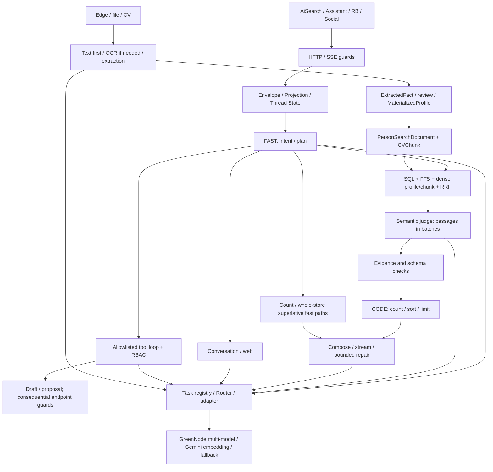

# AI Brain V2 — baseline trước thay đổi

Ngày kiểm: 2026-09-07. Source of truth: workspace `D:\Project\MSB_Radar`,
HEAD `7729f86`. `git status --short` và `git diff --stat` ban đầu rỗng.
Không pull, reset, checkout hay dùng code GitHub thay workspace.

## Phạm vi và mức chứng minh

Đã đọc các đường runtime dưới ai, talent/answer, talent search/vector,
RB/Social, intel extraction/materialization, People/Document/SourceRecord,
frontend AiSearch/AnswerView và kiểm tra tests, acceptance/governance hiện có.
Đây là audit source + local DB + deterministic probes; không phải nghiệm thu
production. Những số trong tài liệu cũ về 786 hồ sơ/38.700 token/75% judge
là số lịch sử, **không** được dùng làm kết quả đo V2.

Chuẩn quyết định: **AI reasons. Code verifies. Humans stay in control.**
`AI_AGENT_ACCEPTANCE_CRITERIA.md` là checklist bắt buộc; một số câu cũ như
“registry không được dispatch động” phải đọc cùng kiến trúc thực tế: dispatch
có allowlist/RBAC đã tồn tại. Không xóa tool loop chỉ vì doc cũ cấm mọi dispatch.
Human acceptance và independent audit chưa có, không tự chứng nhận thay người dùng.

## Architecture map

### Current task → provider → model and AI-call map

23 task routes verified in local DB. All match registry defaults below. These
are **configured routes**, not proof of successful inference. Router permits
fallback. GreenNode `/models` was called successfully during this audit and
returned seven IDs: Qwen 3.6 Flash/Plus, Qwen 3.7 Plus, DeepSeek V4 Flash/Pro,
GLM 5.2 hackathon, Gemma 4 31B IT. No performance ranking inferred from listing.

Abbreviations: QF = `greennode / qwen/qwen3.6-flash`;
DP = `greennode / deepseek/deepseek-v4-pro`;
DF = `greennode / deepseek/deepseek-v4-flash`;
GE = `gemini / models/gemini-embedding-2`.

| Business task | Caller | Route | Role / code control |
|---|---|---|---|
| talent_answer_plan | talent/answer/plan.py | QF | Plan JSON; schema/limit normalization |
| talent_answer_judge | talent/answer/judge.py | QF | Semantic relevance/extraction; quote verification |
| talent_answer_compose | talent/answer/compose.py, engine.py repair/stream | DP | Prose after code aggregate; citations/order check |
| talent_corpus_qa | talent/corpus_qa.py | QF | Legacy corpus answer; CV read guard |
| talent_search | talent/hiring_need.py | QF | Criteria extraction, SQL filter consumers |
| talent_embedding | talent/vector_index.py | GE | Direct embedding HTTP; dimension check, separate config |
| person_qa | talent/person_qa.py | DF | Single-person answer; 600 output-token call |
| assistant_conversation | ai/conversation.py, answer/chat.py via adapter | QF | General conversation; bounded projection |
| assistant_intent | ai/intent.py | QF | Branch selection; heuristic fallback |
| assistant_web | ai/websearch.py | QF | Web synthesis; URL/evidence output |
| assistant_agent | ai/agent.py, ai/graph_agent.py | QF | Bounded tool loop; allowlist and RBAC |
| assistant_outreach | ai/tool_handlers.py | QF | Draft only; no actual message send |
| cv_parsing | core/cv_parsing.py | QF | Clean poor text; good text bypasses AI |
| cv_ocr | core/cv_parsing.py | QF | Image/scanned CV fallback |
| candidate_extraction | intel/extraction.py | QF | Missing fields → provenance facts/review |
| candidate_intake_extraction | intake/extract.py | QF | Intake JSON; deterministic fallback |
| cv_reference_extraction | intel/contacts.py | QF | Candidate vs referee contacts; marker gate |
| jd_parse | hiring/jd.py | QF | JD JSON validation |
| outreach_draft | hiring/outreach.py | QF | Draft; human send workflow |
| rb_prospect_search | rb/prospects.py | QF | AgentBase optional → router → keyword fallback |
| rb_outreach_draft | rb/outreach.py | QF | Draft; truncation fallback |
| social_intent | social/intent.py | QF | Financial/job intent; identity/source/threshold guards |
| title_similarity | talent/semantic.py | QF | Legacy semantic title score; cached |

Infrastructure calls: Router.complete/stream → providers.complete/stream;
RouterAdapter wraps calls and usage; provider ping in ai/views.py bypasses
business tasks intentionally. Model listing is metadata, not inference.
`ai/graph.py` stream is workflow execution, not an additional LLM call.
Optional AgentBase HTTP in RB is a separate inference boundary; include it
when benchmarking enabled deployments. Existing task-registry tests inspect
call sites; preserve them and extend detection as new call styles are added.

### Search / Answer

`talent_ask` checks authenticated CV access, builds envelope, then uses
`engine.answer` (JSON) or `runner.stream` (SSE + background persistence).
Plan once; `_pipeline` accepts the existing plan to prevent double planning.
Count skips retrieve/judge. Whole-store superlative scans structured fields and
text with coverage. Other queries resolve pins, add structured pins, retrieve,
judge, aggregate. One widening pass is allowed under a soft 15-second budget.
Cache stores judge output for six hours; compose runs every turn.

Retrieval: up to six queries, four dense workers, 90 IDs per branch/query,
RRF merge, adaptive pool 16–60, four 700-character CV passages at head and two
at tail plus a profile passage. Empty structured fields do not hard-veto
semantic results in the main Answer Engine. Structured pins supplement recall.
Non-PostgreSQL FTS uses OR-icontains; it is not a pgvector/GIN benchmark.

Judge: batches of 8, four workers, 4,000 output tokens, 70-second per-call
budget, split retry. Code verifies quote occurrence but not semantic entailment.
Aggregate computes sort/count/limit; some numeric inputs are unverified LLM
extractions. Compose checks have different coverage between JSON and SSE paths.

### Conversation / tools / workflow state

Projection contains recent turns, summary, active criteria, memories and last
result; Thread State v2 stores criteria, patches, pending actions, pins and
last result. Recent-turn/context character limits already exist. A snapshot
preserves displayed IDs, but deterministic ordinal resolution is incomplete.
`resolve.followup_people` pins the previous group and `pinned_for` caps at 8;
the LLM still decides which member an ordinal refers to in the answer path.

Tool dispatch validates known names and module permission, then calls handlers.
Agent tool set includes evidence/provenance/canonical lookup/compare/memory
proposal/feedback/draft/web enrichment. RB/Social apply deterministic identity,
DNC/threshold/scoring checks. Keep existing consequential-action guards; audit
public endpoints separately from internal read-only helpers. This project does
not have per-row Talent visibility in main retrieval; do not claim otherwise
or silently redefine the deferred HM/RM product policy.

### Existing intelligence snapshot — preserve

`ExtractedFact` already stores source kind, document/source-record, evidence,
confidence, schema version, model, validity and review status.
`MaterializedProfile` stores accepted facts with projection version and build
timestamp. `PersonSearchDocument` and `CVChunk` have fingerprints/embedding
versions. Extend these incrementally if measurements justify it; do not add a
second competing Person Intelligence database or discard raw CVs.

## Measured baseline

| Check | Evidence / result |
|---|---|
| Backend baseline | `python manage.py test ai talent rb social agents intel people --noinput --verbosity 1`: 1,020 tests PASS, 313.387 s |
| Test settings | Python 3.9.6, Django 4.2.23; DEBUG=true, DATABASE_URL=sqlite:///:memory:; local data untouched |
| Frontend baseline | `npm test -- --reporter=dot`: 11 files, 65 tests PASS, 60.06 s; jsdom scrollTo warnings |
| Local DB read-only inventory | 8 People; 10 Documents; 10 core.SourceRecords; 14 ExtractedFacts; 1 MaterializedProfile |
| Local retrieval coverage | 0 PersonSearchDocument; 0 CVChunk — no indexed local corpus for Recall@K |
| Provider config | DB: Gemini enabled with encrypted key; GreenNode disabled/empty DB key. Router can construct GreenNode via bootstrap env and task route pins it. Investigate disable semantics separately |
| GreenNode current inventory | GET /models success, seven model IDs listed above |
| Intent / semantic answer quality | NOT MEASURED on labelled workload |
| Retrieval Recall@K / Precision@K | NOT MEASURED; no labelled indexed local corpus |
| Evidence / hallucination rates | NOT MEASURED at workload level; deterministic counterexamples below |
| Live query tokens, P50/P95, cost | NOT MEASURED; historical LLMCall rows are not V2 baseline |
| Human Acceptance@K | NOT MEASURED |

## Ten highest-priority root causes

Severity reflects correctness/security risk, not frequency (frequency unmeasured).

| # / Severity | Symptom and source evidence | Root cause | Proposed change / expected gain | Migration risk / regression gate |
|---|---|---|---|---|
| 1 P0 | `plan.widen` turns must_have into should_have; probe: exclusion disappears | Retrieval expansion mutates business constraints | Broaden queries only; preserve requirements/exclusions/next steps | Existing test explicitly expects old behavior; document contract correction and replace with negative integration case |
| 2 P0 | `_parse_batch` accepts `thoa="false"` as true; no evidence gives confidence .4 while aggregate floor is .35; probe selects it | JSON coercion and acceptance policy fail open | Strict boolean/finite schema, distinguish verified inference/unknown; unsupported judgement cannot qualify | More unknowns on weak model outputs; benchmark genuine semantic recall, don't substitute keyword veto |
| 3 P0 | Plain `boc_duoc` number 1990 survives even when source only says Python; aggregate uses it for sort | Numeric fact has no per-attribute provenance contract | Attribute evidence/status; only supported numeric facts may determine ordering | Version extraction/cache; old useful semantic text remains labelled inference |
| 4 P1 | Partial row list succeeds; duplicate id probe returns two judgements; retry halves use OR | No exact batch-coverage contract; failure is batch boolean rather than missing IDs | Track unique covered/missing IDs, retry missing only, expose partial and avoid caching incomplete output | Preserve good partial rows; regression for duplicate/missing/malformed/timeout |
| 5 P0 | Reversing last-result IDs gives same `_context_marker` | Set normalization destroys ordinal semantics; cache omits relevant workflow intent | Ordered context identity + bounded state/memory version; bypass ambiguous contextual cache | Intentional cache misses; stable repeated query must still hit |
| 6 P1 | followup pins all previous people, max 8; retrieval ultimately iterates order[:pool] even for oversized pins | Pinning recall confused with resolving referenced subset | Resolve explicit ordinals to IDs from displayed order; explicit scope vs candidate hints | Do not guess ambiguous reference or let structured pins expand a referenced set |
| 7 P0 | `verify.check` accepts `[999]` with no source; sync compose not equivalent to stream repair | Citation syntax treated as groundedness; surface divergence | Verify membership/ownership and common final validation | Avoid claiming substring entailment; conservative fallback for unverifiable statements |
| 8 P1 | Router error records latency=0; embedding bypasses LLMCall; stage trace lacks per-call tokens/cost | Observability split between calls, embedding and pipeline stages | Request-scoped trace, per-attempt timing/usage/cache/candidate counts, unknown tokens as null | Never store CV text/secrets or model chain-of-thought in public trace |
| 9 P1 | Existing `answer_eval` has mostly bool expect_people and global citation presence; local index empty | No labelled IDs/coverage denominators; test success confused with live acceptance | Versioned fixture gold + separate human-label protocol; deterministic scorers, same tasks/models | Synthetic ground truth must be labelled synthetic, never presented as human truth |
| 10 P1 | Tail evidence cut by RRF rank; missing chunks use CV prefix; each query re-reads passages; 70s judge/60s embedding vs soft 15s overall | Evidence relevance, cache reuse and actual deadlines not measured together | Passage relevance/coverage diagnostics; reuse existing intelligence and bound work by measured workload | Must measure recall before reducing pool; no new snapshot migration until justified |

Additional risks to track: `_verify_quote` can match only a prefix then keep a
strong rationale; fallback passage proves source existence, not claim truth;
`build_sources` discards exact/source status. `_next_steps` may throw on wrong
JSON type. Whole-store estimates must not answer semantic NOT/AND counts as
exact. `AnswerResult.as_dict`, assistant done and persisted reasoning metadata
still expose/store reasoning despite Talent SSE suppressing reasoning events.
Model capability validation in settings is not sufficient for router fallback.

## Hotspots, duplicated and legacy paths

- Token upper bound by source constants: 60 dossiers × 2–4 passages × 700
  chars, profile passages, repeated system/criteria per batch; not actual tokens.
  Judge retry can duplicate input; compose receives evidence again.
- Latency: multi-query embedding (60 s socket timeout), parallel judge waves
  (70 s each call), retry halves, compose/revision. Soft 15 s only skips widen;
  it does not cancel in-flight work. No production P95 claim is possible yet.
- `hiring_need`, `corpus_qa`, `person_qa`, structured search, title similarity,
  semantic_index and graph/plain agent have active consumers. Preserve until
  caller map and regression prove a path unreachable.
- Keep router/task registry/key rotation/stream adapter, source originals,
  privacy redaction before judge, extraction review/materialization, SQL/RRF,
  bounded workflow memory, SSE background completion, deterministic business
  scoring and action endpoints. No big-bang rewrite.

## Phase gates

1. Capture baseline final tests before runtime edits.
2. Add deterministic gold/harness and collect failing results before fixes.
3. Fix intent/retrieval contracts before downstream evidence/state changes.
4. Benchmark existing snapshot/passage use before schema work.
5. Run live same-task GreenNode comparisons without changing saved routes.
6. Record measured vs unmeasured outcomes, remaining weaknesses and independent
   acceptance requirements. No claim of Done while any mandatory metric lacks evidence.
