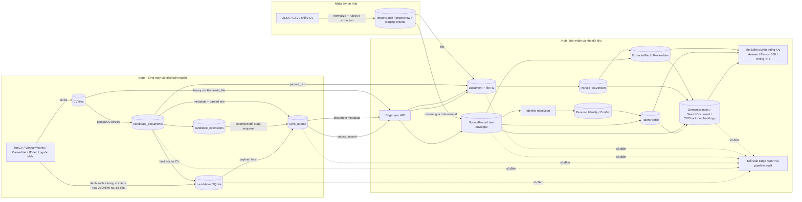

# Kiểm toán luồng và mức khai thác dữ liệu Radar

Ngày kiểm toán: 2026-09-09. Tài liệu này mô tả đường chạy trong code hiện tại;
số liệu production lấy từ `audit_data_pipeline` và cần đọc lại sau mỗi deploy.

## Sơ đồ toàn tuyến

## Hợp đồng dữ liệu và nơi khai thác

| Nhóm dữ liệu | Nguồn thật | Giữ thô | Chuẩn hóa | Được tìm/lọc | Khoảng hở còn lại |
|---|---|---:|---:|---:|---|
| Định danh ứng viên | Edge/import | `SourceRecord.payload` | `Identity` | Có | Bản ghi không có email, phone, LinkedIn hay provider person ID phải chờ xử lý; không tự gộp bằng tên. |
| Lượt ứng tuyển | Edge | Có, gồm source/account/cv/application/campaign/status/time | `ExtractedFact` cho vị trí, ngày, nguồn | Có qua projection | Chưa có mô hình miền riêng cho Application; status/campaign/note hiện chủ yếu được recall dạng text. |
| Trang chi tiết nguồn | Edge `source_payload` | Có sau bản sửa 2026-09-09 | Parser hiện tại + có thể tái chiếu về sau | Có qua SearchDocument | Raw cũ chưa lên Hub phải full sync lại từ Edge. |
| Trường mở rộng parser | Edge `candidate_extensions` | Có version sau bản sửa | Theo namespace/schema_version | Có qua SearchDocument | Hub chưa có registry projector riêng cho từng namespace mới. |
| CV binary | Edge/import | R2, khử trùng theo SHA-256 | Preview + parser/OCR | Có gián tiếp | File thiếu trên Hub chỉ phục hồi được khi Edge còn file và online. |
| Text CV | Edge parser hoặc Hub parser/OCR | `ParsedTextVersion` có hash | AI extraction có evidence | Full-text, semantic, dense | AI structured extraction hiện ưu tiên CV mới nhất; text mọi CV vẫn được tìm kiếm và vector hóa. |
| Trường hồ sơ chuẩn | Edge + AI + người dùng | Fact có provenance | `TalentProfile`, canonical registry | Có | Alias AI chưa duyệt có thể nằm ở proposed, nên chưa thành bộ lọc cấu trúc. |
| Dữ liệu nhạy cảm | Edge/CV/import | Có trong vùng kiểm soát | Fact nhạy cảm vào review | Chỉ theo RBAC/masking | Gender, DOB/tuổi và hôn nhân có thể vào phân tích có nguồn; Radar giải thích và khuyến nghị, người dùng quyết định. |
| Lịch sử CV/lượt ứng tuyển | Mọi SourceRecord/Document của Person | Có | Sắp theo thời điểm quan sát | Có sau bản sửa | Cần backfill lại SearchDocument/SemanticIndex để dữ liệu cũ tham gia đầy đủ. |
| Embedding | SearchDocument/CVChunk | Fingerprint + model | GreenNode BGE-M3 ưu tiên sau probe | Dense retrieval | Cần theo dõi độ phủ và không trộn vector khác model/khác chiều. |
| Nhập tay | `/data` | Batch/row + staging volume | normalize, dedupe, AI/rule extraction | Có sau commit | Draft cũ nằm trong `/tmp` trước bản sửa không thể tự phục hồi nếu file đã mất. |

## Các gap đã phát hiện và cách đóng

1. **Hub không có mẫu số phía Edge.** Trước đây `last_seen_at` chỉ nói Edge từng
   liên lạc, không chứng minh 1.075/20.000 hồ sơ đã về đủ. Edge nay gửi báo cáo
   chỉ-đếm cho candidates, documents và outbox; audit tính chênh lệch.
2. **Raw provider payload bị giữ lại ở Edge.** `source_payload`, note và metadata
   file gốc nay nằm trong envelope Hub để có thể chạy parser/projector mới mà
   không cần crawl lại nguồn.
3. **`candidate_extensions` là ngõ cụt.** Extension có schema version nay tham gia
   payload hash và mỗi lần đổi tự enqueue sync.
4. **Chỉ mục hồ sơ chỉ đọc năm SourceRecord đầu.** Giới hạn này đã bỏ; mọi lượt
   ứng tuyển của Person tham gia projection, với trần ký tự tổng để bảo vệ RAM.
5. **Semantic index bỏ qua dữ liệu Edge không có trong CV.** Nay nhận cả payload
   SourceRecord, gồm vị trí ứng tuyển, trạng thái, ghi chú và raw envelope.
6. **Tìm kiếm truyền thống không đọc projection đầy đủ.** `SearchDocument` đã được
   nối vào nhánh tìm chữ tự do và full-text PostgreSQL.
7. **Không đối soát được dữ liệu thô đang được dùng hay bị bỏ.** Audit nay đếm độ
   phủ từng key payload, raw source, extension, parsing, fact, profile và vector.
8. **Lượt sync thường chỉ xét 1.000 row đầu rồi bỏ cursor.** Với kho lớn, thay đổi
   ở row cũ phía sau có thể không bao giờ được enqueue. Mọi lượt nay quét toàn bộ
   theo trang; payload hash giữ bản ghi không đổi là no-op nên không phát sinh gửi thừa.

## Việc vận hành bắt buộc sau khi phát hành

1. Cập nhật Edge lên bản có raw envelope và data report, rồi chạy **Đồng bộ lại từ đầu**.
2. Chạy lại projection text/semantic cho toàn bộ Person; embedding worker tự bù vector.
3. Đọc `audit_data_pipeline`: `candidate_gap` phải về 0; outbox pending/inflight/failed
   phải giải thích được; raw/extension coverage phải tăng sau full sync.
4. Xử lý hồ sơ pending theo hai nhóm riêng: thiếu định danh và xung đột định danh.
5. Khôi phục file Hub thiếu từ Edge; parse lại file failed/pending; không coi metadata
   đã tới là tài liệu hoàn chỉnh.
6. Sau khi full sync hoặc đổi projector, chạy theo trang cho tới hết kho:
   `python manage.py rebuild_data_products --after-id <last_id> --limit 1000 --enqueue-ai`.
   Lệnh dựng profile, fact hiện có, semantic index và SearchDocument; AI extraction
   được enqueue riêng, embedding worker bù vector riêng nên có thể dừng/tiếp tục.

## Giới hạn có chủ đích

- Không biến tên thành định danh mạnh, vì sẽ gộp nhầm người trùng tên.
- Không tự chấp nhận trường nhạy cảm hoặc fact thiếu bằng chứng.
- Raw payload được giữ để tái xử lý và recall, nhưng không tự động trở thành fact
  chuẩn hay hiển thị công khai.
- Dữ liệu vận hành cục bộ như mật khẩu, cookie, token và trạng thái UI không đồng bộ.
